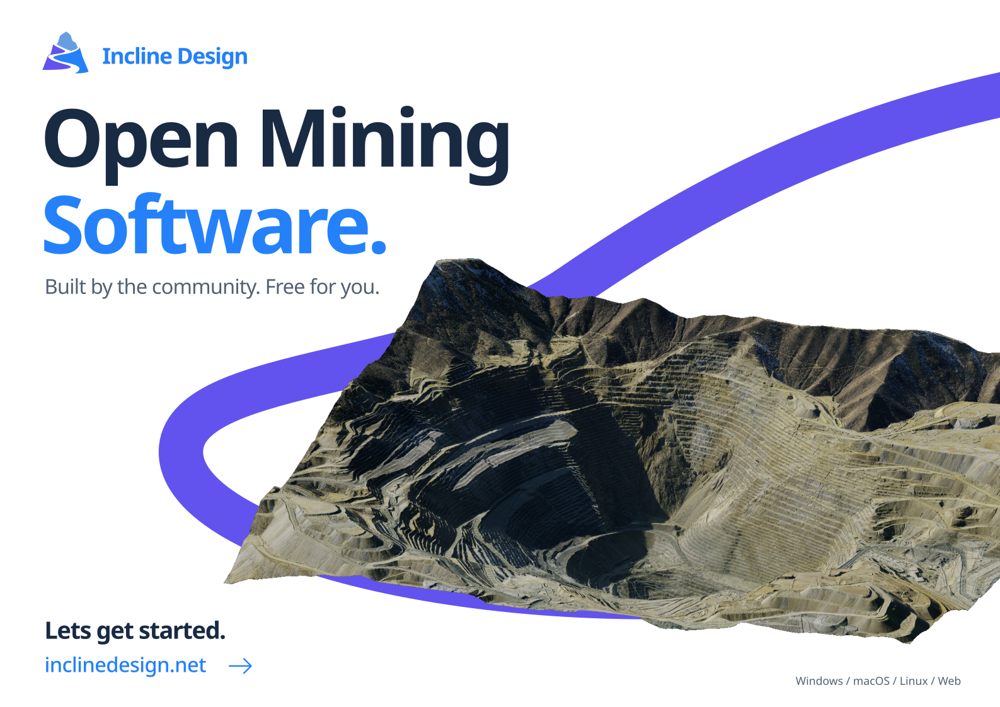

# Incline Design

[Incline Design](https://inclinedesign.net/) is a free open-source application for mine design, planning, geological modeling, and geospatial data.

Built for mine engineers, geologists, surveyors, researchers, and scientists, Incline provides capable mining software without expensive or restrictive licensing. Incline is developed openly by the community under the MIT License and provides a framework in which new mining technologies, workflows, and algorithms can be developed, and trialled.

Cross-platform, lightweight, and built for mining professionals. Incline Design is free for everyone.

## Getting Started

Check out the [releases page](https://inclinedesign.net/downloads/) and grab the latest version of Incline Design!

Incline is available for Windows, Linux, macOS, and WebAssembly.

## Features

### Mine Design

Create and edit mine designs using points, lines, polylines, circles, text, and triangulations. Incline features a suite of design tools such as pit and stockpile shell generation, offsets, chamfers, Bézier curves, and surface draping, alongside tools for clipping triangulations, generating contours, and merging pit and stockpile shells into terrain.

### Geological Modeling

Coming Soon!

### Mine Planning

Coming Soon!

### Geospatial Data & Survey

Coming Soon!

### Localisation

Incline supports: English, Español, Português, Français, 简体中文, Bahasa Indonesia, Русский, العربية, فارسی, हिन्दी, Deutsch, Italiano, Polski, Türkçe, Tiếng Việt, Монгол, Kiswahili, 日本語, 한국어 and Українська.

## Example data

The [`examples`](examples/) directory contains a small OMF 2 project with a pit-shell design, mine surface triangulation, point cloud, drillholes, and an orthophoto raster. Create a project, then use **File → Import** to load [`pit_design.omf`](examples/pit_design.omf) and explore the datasets together.

## License

Incline Design is licensed under the [MIT License](LICENSE.md).

## Maintainers

- **Leo Timmins**, github: *leotimmins1974*, email: `leo@inclinedesign.net`.
- **Lucas Timmins**, github: *trimental*, email: `lucas@inclinedesign.net`.

## Committers

- **Norman Heckscher**, github: *normanheckscher*.
